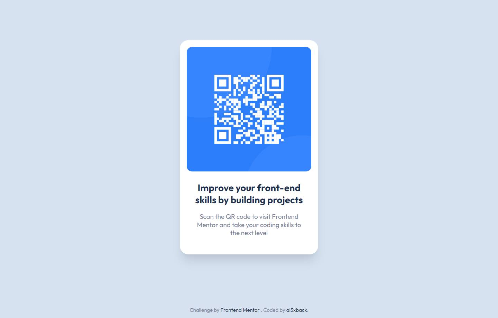

# Frontend Mentor - QR code component solution

This is a solution to the [QR code component challenge on Frontend Mentor](https://www.frontendmentor.io/challenges/qr-code-component-iux_sIO_H). Frontend Mentor challenges help you improve your coding skills by building realistic projects.

## Overview

### Screenshot

### Links

- Solution URL: https://github.com/al3xback/QR-vue-tailwind
- Live Site URL: https://al3xback.github.io/QR-vue-tailwind

## My process

### Built with

- Vue - JS library
- Tailwind CSS

## Author

- Frontend Mentor - [@al3xback](https://www.frontendmentor.io/profile/al3xback)
- Twitter - [@al3x_back](https://twitter.com/al3x_back)
